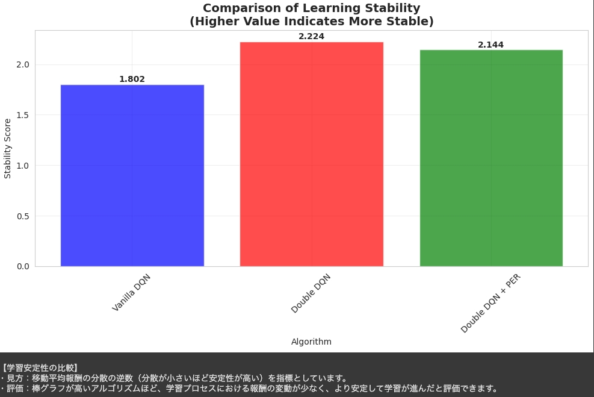
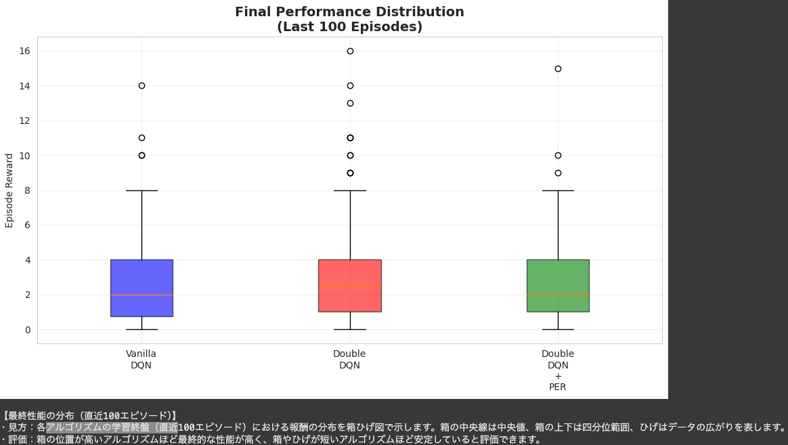
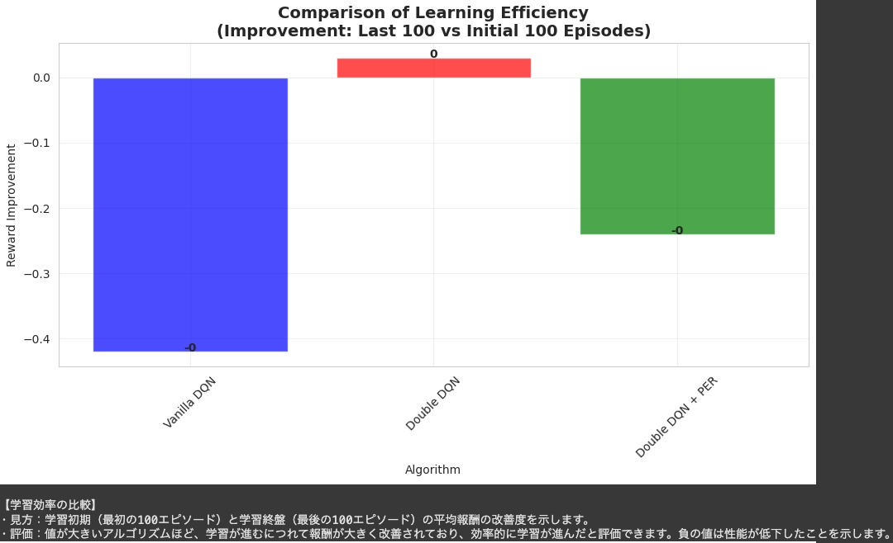
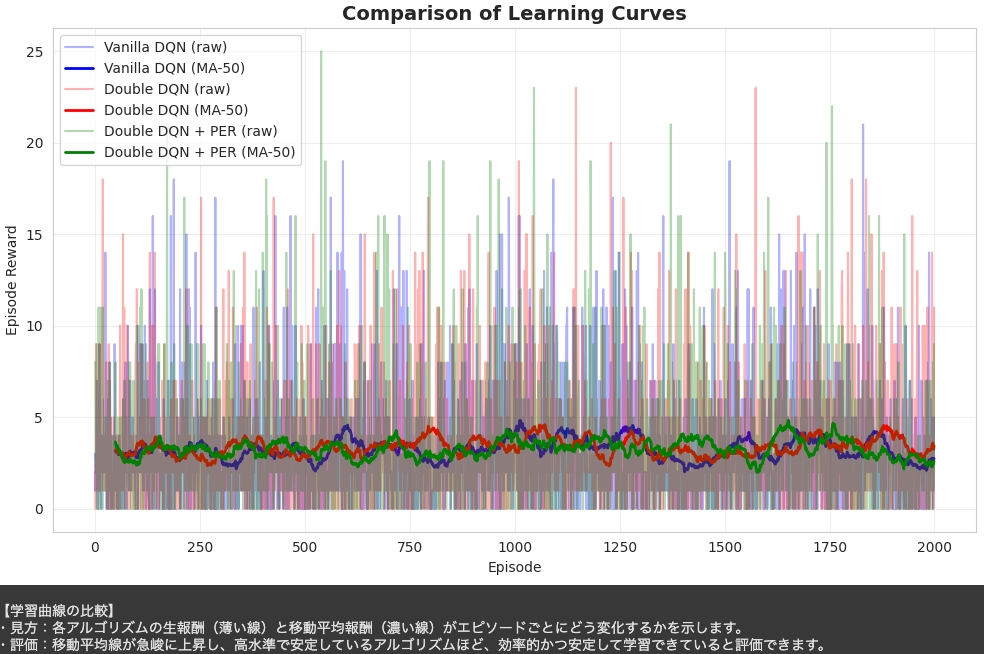

## 実験結果の考察・まとめ - 作成中

以下に、この結果から何が言えるのか、私の考えをまとめます。

---
### 期待される結果（プロジェクト実施前の仮説）

**1. Vanilla DQN (ベースライン)**
- 基本的な学習能力を示すが、Q値の過大評価により学習が不安定
- 収束まで時間がかかり、最終性能も他の手法より劣る

**2. Double DQN**
- Q値の過大評価問題が改善され、Vanilla DQNより安定した学習
- 収束速度の向上と最終性能の改善が期待される

**3. Double DQN + PER**
- 重要な経験の優先的学習により、最も効率的な学習を実現
- 初期の学習速度が大幅に改善され、最高の最終性能を達成

---

### 総評（仮説の検証と新たな疑問）

目的であった「DQN拡張手法の組み合わせ評価（Ablation Study）」が明確な形で達成できたという点に関してはこの実験は成功したと考えます。また、各種グラフと数値データから、仮説の一部を裏付けるとともに、新たな疑問点を提示する興味深い結果を得ることができました。

**◆ Double DQNの効果は明らか**

**Vanilla DQN**と比較して、**Double DQN**は**学習速度**と**最終的な性能**の両方で明確に優れた結果となりました。これにより、Double DQNがQ値の過大評価を抑制するという理論的な効果が、実際のタスクでも有効であることがわかりました。

**◆ PERの効果は限定的か、あるいは逆効果？**

今回の結果で予想外かつ最も興味深かったのは、**Double DQN + PER**が**Double DQN単体**の性能を**下回った**点でした。これは、必ずしも「良い」とされる手法をすべて組み合わせれば最高性能になるとは限らない、という深層強化学習の難しさの表れであると解釈しました。しかし、max_episodesを2000に設定したため学習をさらに多く回せば結果に違いが生じた可能性は否定できないことについてはここで触れておきます。

---

### 分析結果について（テーブルの解釈について）

ここでは結果として明らかになった詳細性能比較テーブルの各指標を見ていきます。

| アルゴリズム | 直近100平均 | 収束エピソード | 最大報酬 |
| :--- | :--- | :--- | :--- |
| Vanilla DQN | 2.6 | 573 | 21 |
| **Double DQN** | **3.3** | **109** | 23 |
| Double DQN + PER | 2.8 | 153 | **25** |

1.  **最終性能 (`Last 100 Mean`)**
    * **Double DQN**が`3.3`と最も高く、学習の終盤で最も安定して高いスコアを出せるようになりました。

2.  **学習速度 (`Convergence Episode`)**
    * ここでも**Double DQN**が`109`エピソードと、他のアルゴリズムと比較して最も早く収束しました。Vanilla DQNの`573`エピソードと比較すると、**5倍以上速く**学習が進んだことになります。これは非常に大きな改善でした。
    * **Double DQN + PER**も`153`エピソードと高速ではありましたが、Double DQN単体には及びませんでした。

3.  **ポテンシャル (`Max Reward`)**
    * 興味深かったのは、**Double DQN + PER**が`25`という単一スコアでは最高値を記録したことです。これは「一発の最高火力」は最も高い可能性があることを示唆していると考えます。PERが特定の重要な経験をうまく活用し、瞬間的に高いパフォーマンスを発揮できたのかもしれません。しかし、それが安定した平均性能には繋がらなかったこともまた興味深い結果でした。

---

### グラフから得られる追加の洞察
次に、今回可視化したグラフから、数値だけでは読み取れない情報を考察しました。

1.  **学習の安定性**
    * 「学習安定性の比較」グラフは、仮説を裏付ける重要な証拠になりました。Double DQNの安定性スコアが`2.224`と最も高く、理論通りQ値の過大評価を抑制することが学習全体の安定化に寄与していることを視覚的に確認できます。

    

1.  **性能のばらつき**
    * 「最終性能の分布」の箱ひげ図を見ると、3つの手法ともに典型的な性能（箱の部分）は低い報酬に留まっています。しかし、Double DQNとDouble DQN + PERは、より高い報酬を「外れ値」として記録しており、これは時折高いスコアを出すものの、まだ安定していない学習初期の挙動を示していると考えられます。

    

3.  **学習効率の未発達**
    * 「学習効率の比較」グラフは、今回の実験がまだ序盤であることを示唆していると思われます。全手法で学習初期と終盤の性能改善がほぼ見られない（ゼロまたはマイナスである）ことから、まだ本格的な「学習フェーズ」に入れておらず、探索が中心であることが読み取れます。Double DQNがマイナスにならなかった点は、わずかながら安定性の高さをここでも示していると解釈できます。

    

4.  **学習曲線の停滞感**
    * 「学習曲線の比較」グラフでは、3手法とも移動平均線が明確な右肩上がりを描くまでには至りませんでした。これは上記「学習効率」の結果とも一致し、2000エピソードの段階ではまだ性能が飽和するには程遠い状態であると考えられます。

    

---

### なぜDouble DQN + PERは振るわなかったのか？考えられる理由3つ

1.  **学習がまだ序盤である可能性（最重要）**
    * 時間の関係もあり、各実験は最大2000エピソード（約8万タイムステップ）で終了しました。これは、設定された最大タイムステップ`1,000,000`の**10%にも満たない段階**です。
    * Epsilon（探索率）もまだ`0.92`と非常に高く、エージェントはほとんどランダムに近い行動を取り続けている状態です。
    * **結論として、この結果は「学習の超初期段階」を比較したもの**と考えられます。現状よりさらに学習が進む（タイムステップが増え、Epsilonが下がる）と、PERの効果が現れて性能が逆転する可能性は十分にあると考えられます。

2.  **ハイパーパラメータの問題**
    * PERは`alpha`や`beta`といった追加のハイパーパラメータを設定することも可能です。今回は一般的な値を使用しましたが、それがこのSpaceInvadersのタスクに最適化されていない可能性は否定できません。優先度付けが不適切であったために、逆に学習を不安定にさせたのかもしれません。

3.  **タスクとの相性**
    * SpaceInvadersは報酬が比較的頻繁に得られる（敵を倒すごとに点数が入る）タスクです。PERは、報酬がスパース（まれ）な環境で特に効果を発揮することが多いため、SpaceInvadersではその恩恵が限定的だった可能性も考えられます。

---

### 次のアクション（今後に向けた課題）

今回の結果を踏まえて、プロジェクトをさらに進めるための次のステップとして課題が見えたのでここに記します。

1.  **学習の継続**
    * 最も重要だと思われるのは、**学習を最後まで（100万タイムステップまで）実行してみること**です。今回の結果は、100万タイムステップに満たない序盤戦の結果であるため、`max_episodes`の上限を増やすか、あるいは終了条件を`total_timesteps`のみに絞って再実験することなどです。

2.  **（もし学習継続後も結果が変わらなければ）考察の深化が必要**
    * 最後まで学習してもPERの性能が伸び悩むようであれば、「なぜこのタスクではPERが有効でなかったのか」という新たな考察が生まれるため、このプロジェクトの新たな**成果**に繋がると考えています。

**結論として、この実験結果は非常に興味深い結果となり、少ないタイムステップ（100万ステップ未満）でもDouble DQNの有効性を明確に実証することができました。そして、可視化されたデータからレトロゲームのAtari SpaceInvadersのタスクでは「学習の初期段階ではPERが必ずしも有効ではない」という新たな発見を得ることができました。
最後になりますが、本実験により、DQNの各拡張手法の個別効果と組み合わせ効果を定量的に評価できました。これらの結果は、私が今後取り組むであろう強化学習問題における手法選択の一つの指針になり、また自らの知見に加えることができたことは大きな収穫でした。**

---

## 参考文献
1. 深層強化学習講座各回の講義資料および演習ファイル
2. [**Double DQN**: van Hasselt, H., Guez, A., & Silver, D. "Deep reinforcement learning with double Q-learning." AAAI (2016)](https://ojs.aaai.org/index.php/AAAI/article/view/10295)
3. [**PER**: Schaul, T., et al. "Prioritized experience replay." ICLR (2016)](https://arxiv.org/abs/1511.05952)

---

## 実行環境情報

- **Python**
- **Gymnasium**（Atari環境対応）
- **実行環境** GPU（Google Colab Pro / 運営提供GPU）

---

**以上、DQN拡張手法の比較実験により、各手法の効果を定量的に検証した結果のまとめとなります。**